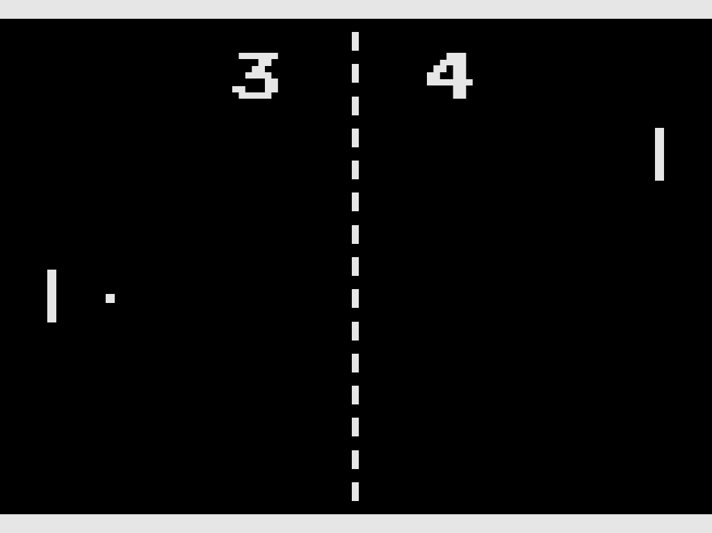

# PyPong
A implementation of the classic Pong in Python! Inspired by a teaching project
I did where I had taught somebody how to code a Pong game with Python. I decided
to go more "all out" with my own version.

# Requirements & Running
To run, you should have Python and PyGame installed. Python 3.13.5 and Pygame
2.6.1 are the canonical versions.

https://python.org/ 
https://pygame.org/

Then, just simply: 
`$ python3 pypong.py`

# TODO
Add an AI opponent!
UX flair & polish.
